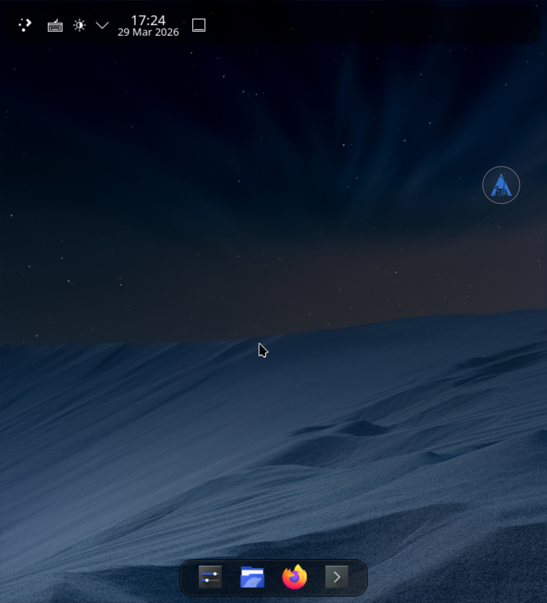
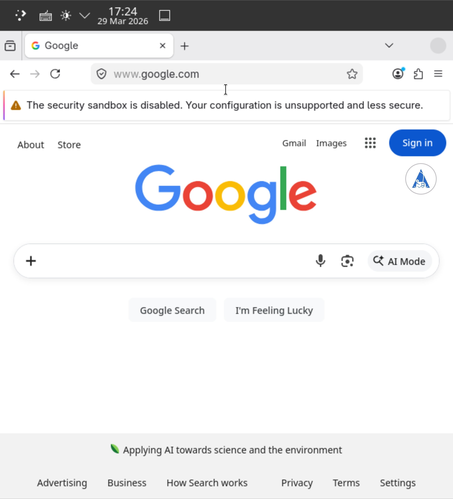
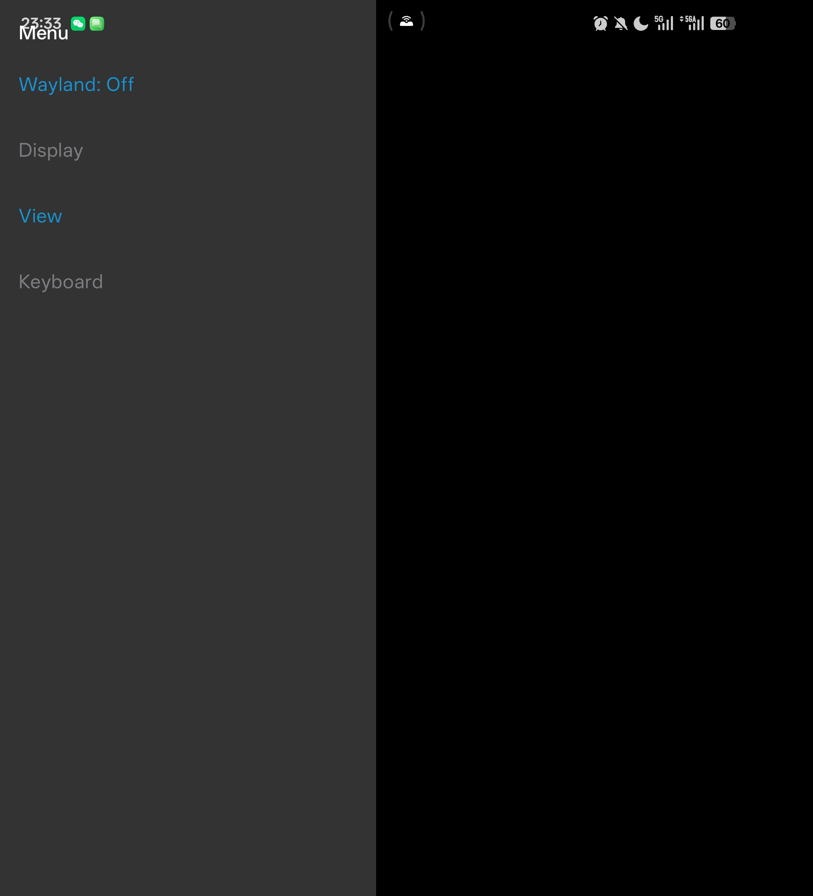
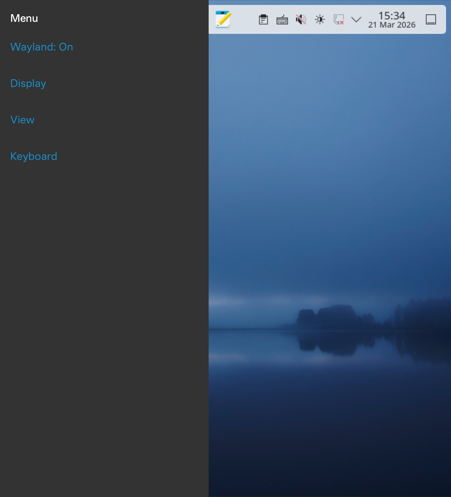
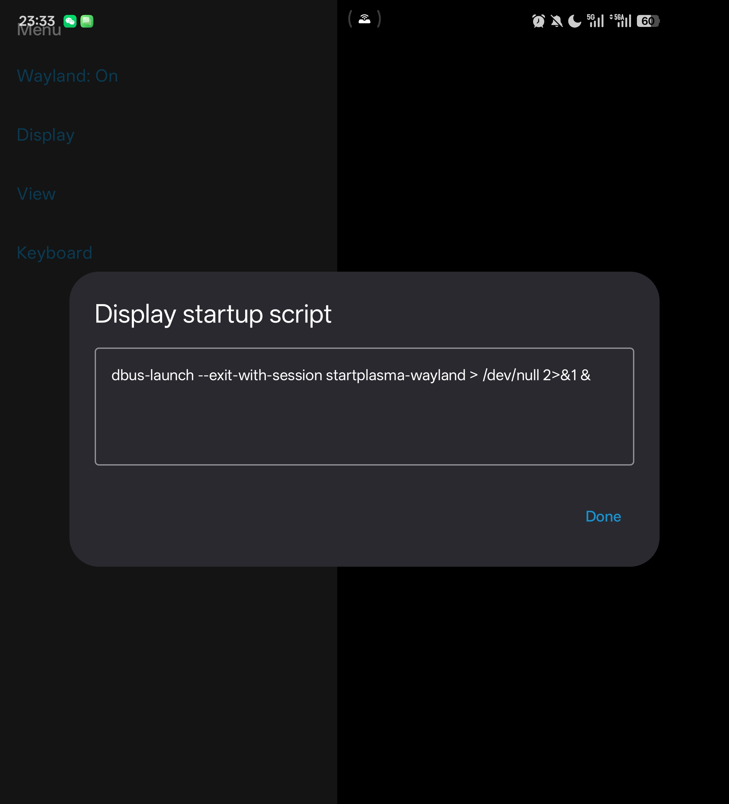
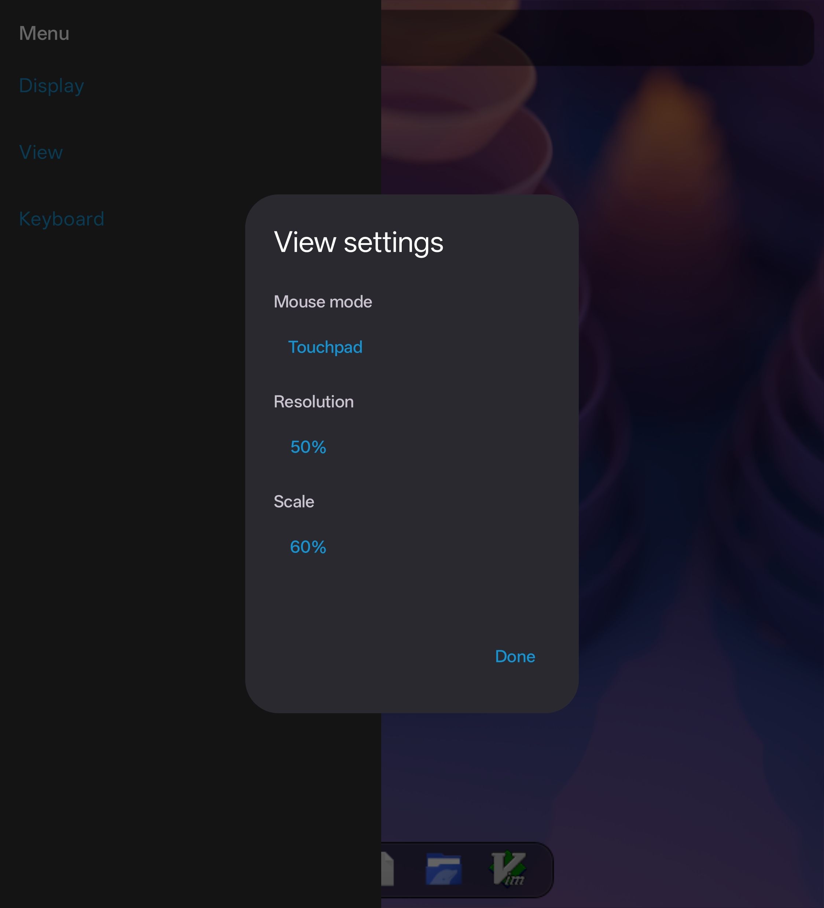
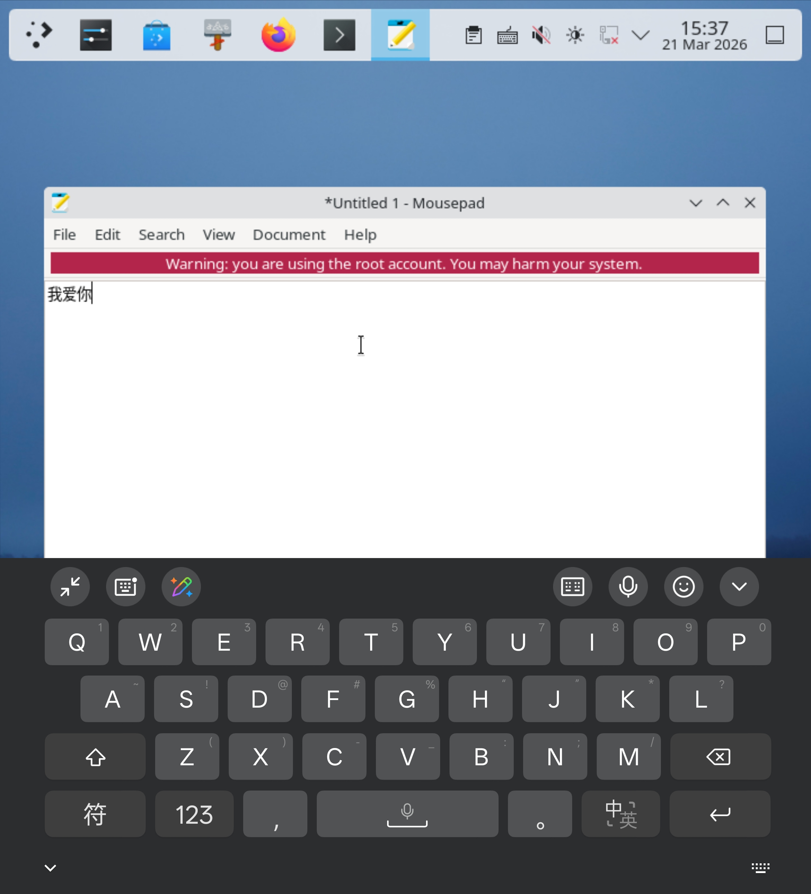

# Trierarch

[English](README.md) | 中文

---

**下载：** 最新 APK 见 **[GitHub Releases](https://github.com/Beauty114514/trierarch/releases/latest)**。

## 演示

| KDE Plasma（Wayland） | Firefox（proot 内） |
|----------------------|---------------------|
|  |  |

---

**Trierarch** 是一款 Android 应用：采用 **proot** 容器技术在设备上运行 **Arch Linux** rootfs；通过自研 **Wayland** 合成器（开发与优化重心在 **KDE Plasma（Wayland）**）。以让用户可打造自己的 **Arch** + **KDE Plasma 6（Wayland）** 个人移动桌面。

## 1. 首次启动：自动下载 rootfs

- 若首次启动时 `data_dir/arch` 下尚无可用的 rootfs，应用会从 [proot-distro](https://github.com/termux/proot-distro/releases) **自动下载并解压** Arch Linux aarch64 rootfs（约 156 MB），需联网。

## 2. 启动桌面前：在 proot 内安装 Plasma（及常用组件）

在应用内进入 **proot 里的 Arch** 终端后，**先更新再安装桌面**（示例；可按需增删包名）：

```bash
pacman -Syu
pacman -S plasma-desktop dolphin konsole
```

## 3. 侧栏与 Display（呼出侧栏、开启 Wayland、运行 Display）

- **侧栏**：用**双指**从**屏幕左侧边缘向右滑动**即可打开侧栏。下图分别为**终端 / Wayland 视图**下与**已进入桌面**后划出的侧栏。

| 终端 / Wayland 视图下的侧栏 | 进入桌面后的侧栏 |
|----------------------------|-----------------|
|  |  |

- 在侧栏开启 **Wayland**。

- **Display**：**长按**可编辑 **Display 启动脚本**；**短按**执行脚本以启动 Plasma。**若已有 Wayland 客户端连接，应用不会重复执行脚本。**

**推荐脚本**（通过 `dbus-launch` 拉起会话 D-Bus，再启动 Plasma Wayland；输出重定向到后台，避免阻塞）：

```bash
dbus-launch --exit-with-session startplasma-wayland > /dev/null 2>&1 &
```



## 4. 进入桌面后：View Settings 与终端 / 桌面切换

### View Settings（视图设置）

在侧栏或相关入口打开 **View Settings**，可调整合成器画面与指针行为：



- **指针 / 鼠标模式**：例如 **触摸板（相对）** 与 **平板（绝对）**，对应不同操作习惯。
- **界面元素大小与清晰度**：**Resolution（分辨率）** 与 **Scale（缩放）** 两类可**叠加**使用——前者可降低输出分辨率以减轻合成负载并调整画面元素大小，后者在不改底层分辨率的前提下通过缩放调整大小并尽量保持清晰。**如何叠、叠多少**没有固定答案，可按自己的设备性能、观感与使用习惯自行尝试、找到合适组合。

### 用 Display 在终端与桌面之间切换

**进入桌面（Plasma）后**，再点 **Display** 可回到**终端 / Wayland 界面**；**再双指从左侧划出侧栏**，再点 **Display** 即可**回到桌面画面**。侧栏与 Display 在终端界面与桌面中均可使用。

## 5. 键盘与输入（侧栏 Keyboard、GTK / Qt）

侧栏 **Keyboard** 可**唤起**软键盘。



在 **GTK 类应用**中，可输入 **非 ASCII** 字符（如中文、Emoji、特殊字符等）；通过 **`Ctrl+Shift+U`** 路径完成输入，侧栏 **Keyboard** 用于向当前窗口发送相应按键。

**Qt 类应用**对同一路径往往不完整：可先在 **GTK 应用**（推荐 **Mousepad**）里输入，再**复制粘贴**到 Qt 应用。**目前 Android 软键盘与 Plasma 桌面剪贴板未打通**，复制粘贴请在 Linux 侧通过鼠标或快捷键完成（如 `Ctrl+C`、`Ctrl+V`）。可用 [**Unexpected Keyboard**](https://play.google.com/store/apps/details?id=juloo.keyboard2) 等全键盘软键盘（[GitHub](https://github.com/Julow/Unexpected-Keyboard)）。

## 6. 软件与体验优化（trierarch-optimize）与 Arch 文档

在 **rootfs 桌面环境内**优化软件使用的**专题教程**见仓库内 **[`trierarch-optimize/README.zh.md`](trierarch-optimize/README.zh.md)**（[English](trierarch-optimize/README.md)），索引内链接各篇说明（如 Firefox、非 ASCII 输入与字体等）。

**Arch Linux 通用折腾与包管理**：系统配置、软件安装、故障排除等，请以 **[ArchWiki（英文）](https://wiki.archlinux.org/)** 与 **[Arch Linux 中文维基](https://wiki.archlinuxcn.org/)** 为准；本应用提供的是 **proot + Wayland** 运行环境，许多 Arch 侧操作与常规桌面 Arch 相同，但部分涉及内核、systemd 完整会话等场景可能受限，需结合实际环境判断。

如需从源码构建应用，见 [`README_DEV.zh.md`](README_DEV.zh.md)。**贡献与安全：** [`CONTRIBUTING.zh.md`](CONTRIBUTING.zh.md)、[`SECURITY.zh.md`](SECURITY.zh.md)；变更见 [`CHANGELOG.md`](CHANGELOG.md)；发版见 [`docs/RELEASING.zh.md`](docs/RELEASING.zh.md)。

## 致谢

Trierarch 依赖大量开源软件，向相关项目作者与社区致谢（**列举不全**）：

- **[PRoot](https://github.com/termux/proot)** 与 **Termux** 生态；Arch rootfs 来自 **[proot-distro](https://github.com/termux/proot-distro)** 发布包
- **[Wayland](https://wayland.freedesktop.org/)** 与 **wayland-protocols**（参考源码位于 `trierarch-wayland/` 下）
- **[libffi](https://github.com/libffi/libffi)** · **Rust** · **Kotlin** · **Jetpack Compose** · **Android** / **NDK**
- **KDE Plasma** 与 **Arch Linux** 社区
- 本文档提及的第三方软键盘 **[Unexpected Keyboard](https://github.com/Julow/Unexpected-Keyboard)**

随仓库打包的上游代码在各自目录中保留许可证文件（如 `COPYING`、`LICENSE` 等）。本小节为致谢与指路，**不构成**完整法律声明；以仓库内实际文件与上游条款为准。
