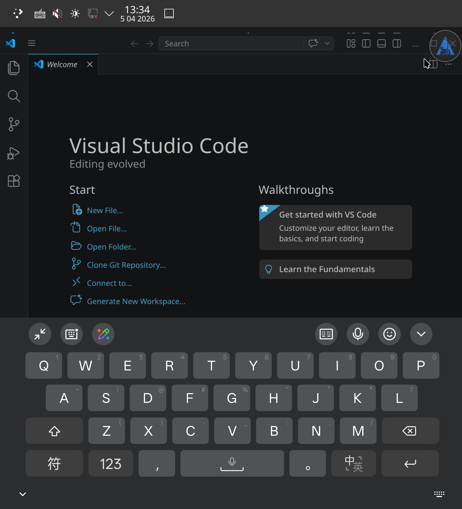
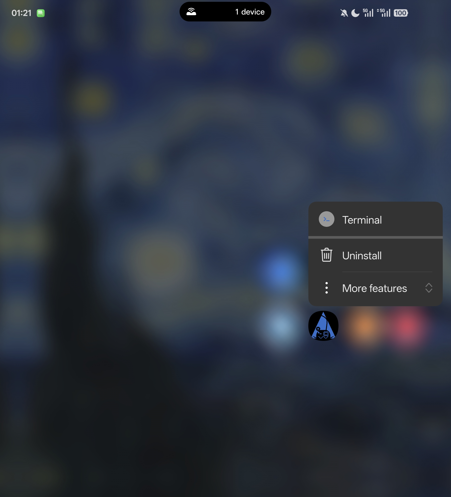
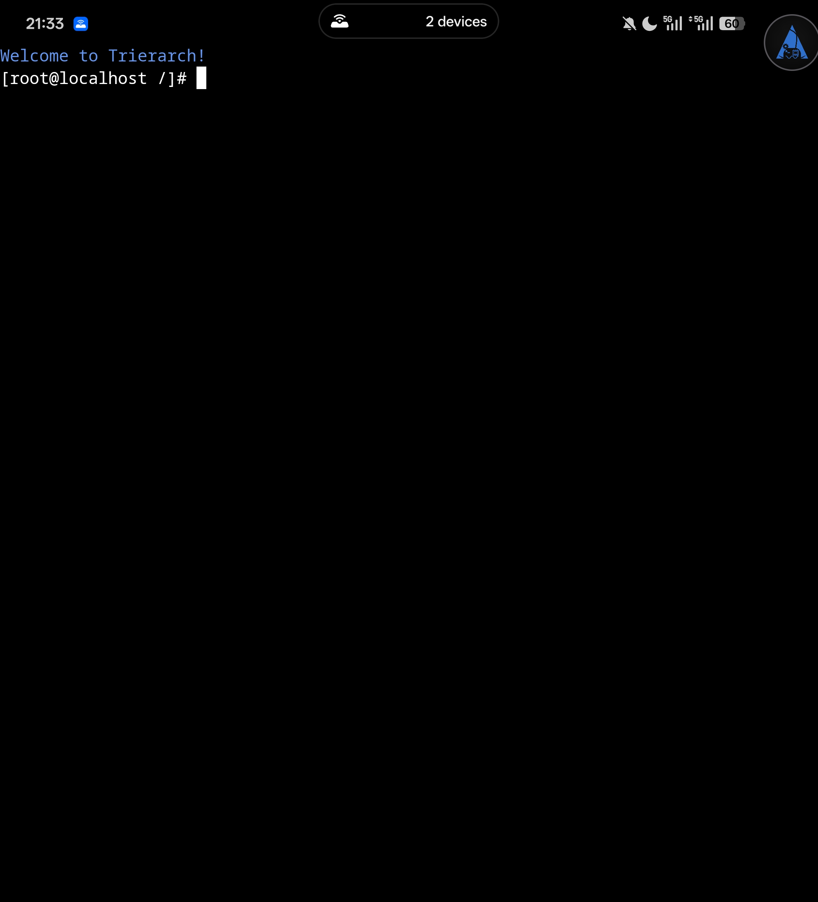
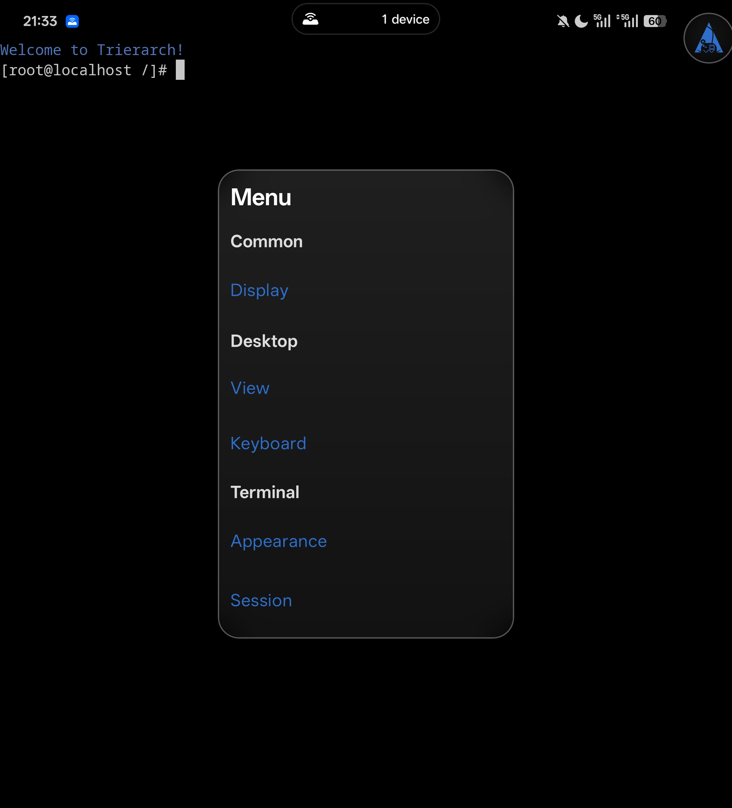
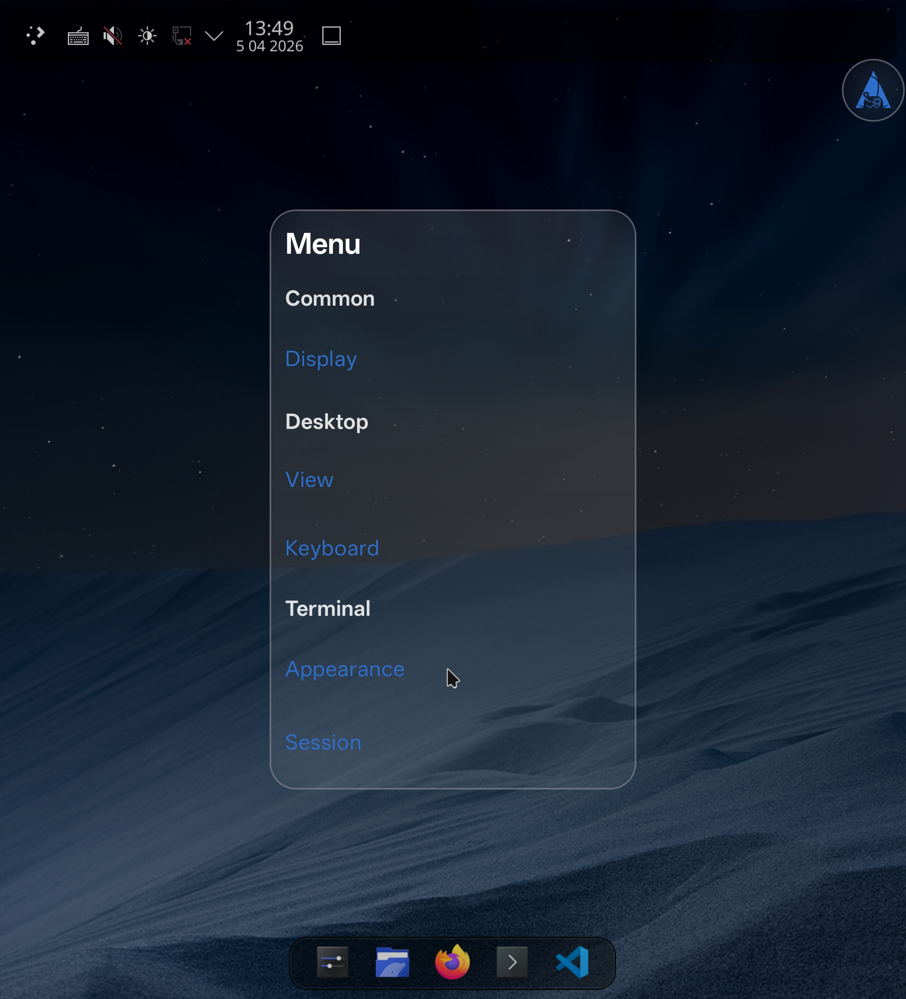
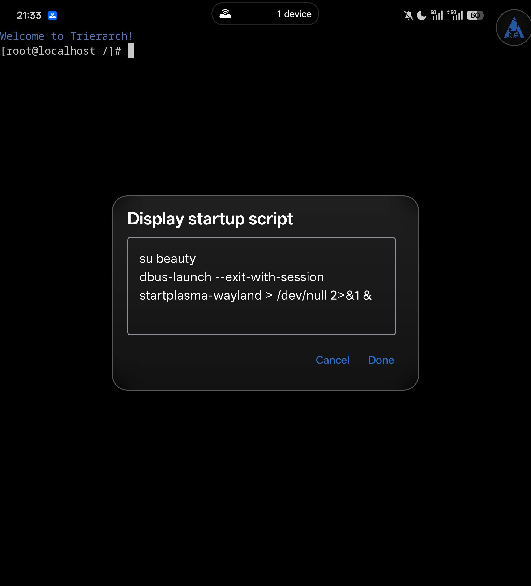
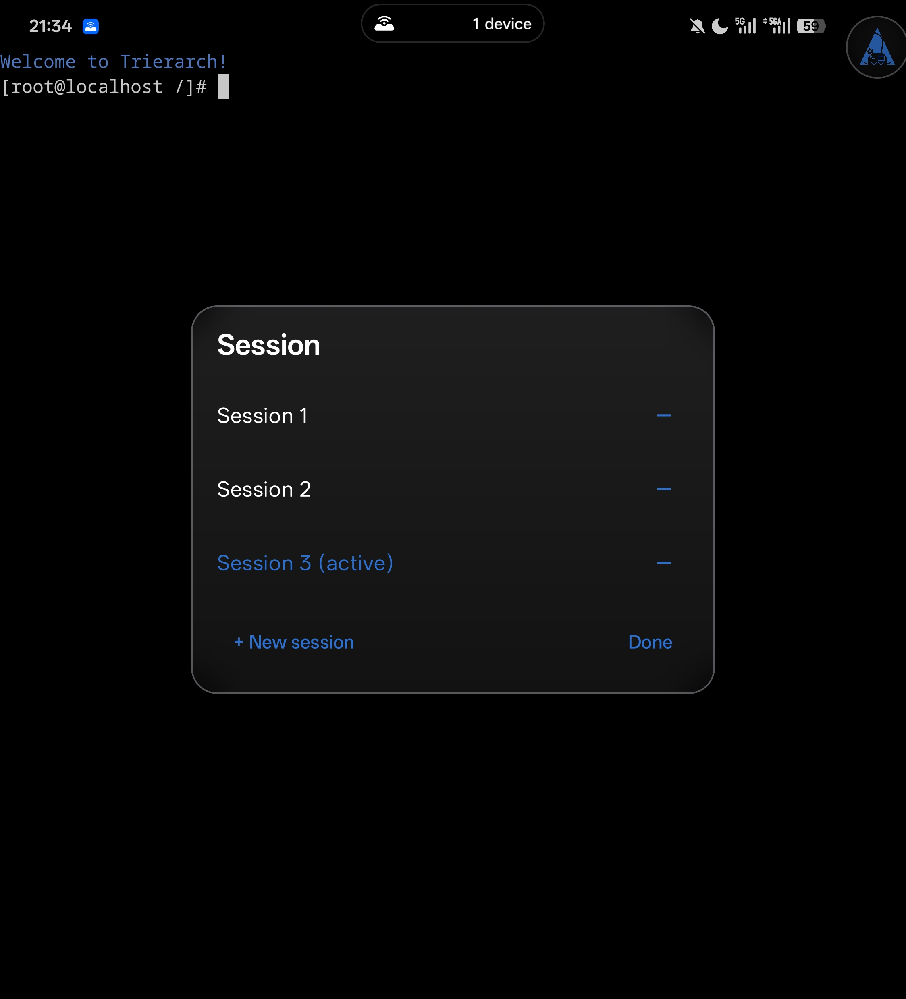
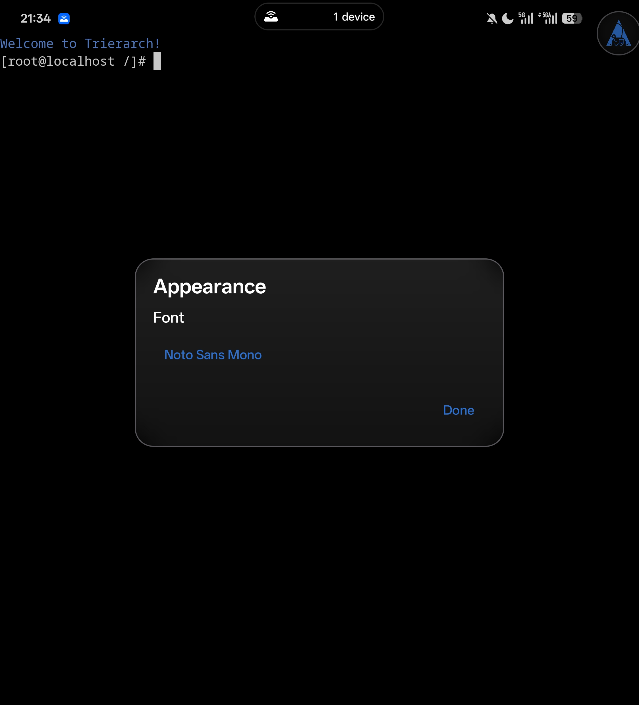

# Trierarch

[English](README.md) | 中文

---

**下载：** 最新 APK 见 **[GitHub Releases](https://github.com/Beauty114514/trierarch/releases/latest)**。

## 演示

| KDE Plasma（Wayland） | VS Code（proot 内） |
|----------------------|---------------------|
|  |  |

---

**Trierarch** 是一款 Android 应用：采用 **proot** 容器技术在设备上运行 **Arch Linux** rootfs；通过自研 **Wayland** 合成器（开发与优化重心在 **KDE Plasma（Wayland）**）。以让用户可打造自己的 **Arch** + **KDE Plasma 6（Wayland）** 个人移动桌面。

## 1. 首次启动：自动下载 rootfs

- 若首次启动时 `data_dir/arch` 下尚无可用的 rootfs，应用会从 [proot-distro](https://github.com/termux/proot-distro/releases) **自动下载并解压** Arch Linux aarch64 rootfs（约 156 MB），需联网。

## 2. 启动桌面前：通过 Terminal（shortcut）进入终端并安装 Plasma（及常用组件）

长按应用图标显示 **shortcut**，点击 **Terminal** 进入 **proot 里的 Arch** 终端。



在终端内，**先更新再安装桌面**（示例；可按需增删包名）：

```bash
pacman -Syu
pacman -S plasma-meta dolphin konsole
```

## 3. 悬浮菜单球与 Display（打开菜单、设置启动脚本、启动桌面）

- **悬浮菜单球**：屏幕上有一颗可拖动的**玻璃球**；**短按**打开**玻璃菜单**（**Display**、**View Settings**、**外观（Appearance）**、**Keyboard** 等入口）。可拖动球到顺手的位置，位置会记忆。



| 终端 / Wayland 视图下拉开菜单 | 已进入桌面后拉开菜单 |
|----------------------------|-----------------|
|  |  |

- **Display**：**长按**可编辑 **Display 启动脚本**；**短按**执行脚本以启动 Plasma。**若已有 Wayland 客户端连接，应用不会重复执行脚本。**

**推荐脚本**（通过 `dbus-launch` 拉起会话 D-Bus，再启动 Plasma Wayland；输出重定向到后台，避免阻塞）：

```bash
dbus-launch --exit-with-session startplasma-wayland > /dev/null 2>&1 &
```

即便在 **proot** 里，也建议**不要用 root 长期跑桌面**：像真机一样**建普通用户**、设密码、用**用户组 / sudo** 管理权限。愿意可自行查阅 ArchWiki（英文 **[Users and groups](https://wiki.archlinux.org/title/Users_and_groups)**；中文 **[用户和用户组](https://wiki.archlinuxcn.org/wiki/用户和用户组)**、**[Sudo](https://wiki.archlinuxcn.org/wiki/Sudo)**）；不依赖 Wiki 时，按下面步骤即可。

**创建用户并配置 sudo（示例用户名为 `myuser`）：**

```bash
pacman -S sudo
useradd -m -G wheel -s /bin/bash myuser
passwd myuser
EDITOR=nano visudo
```

在 `visudo` 里可以：**取消注释** `%wheel ALL=(ALL:ALL) ALL`，让 `wheel` 组用户都能用 `sudo`；**或者**保留该行不动，在它**下面另起一行**写上 `myuser ALL=(ALL:ALL) ALL`，只给该用户提权。也可以在 **`/etc/sudoers.d/`** 下单独放规则文件（语法相同；可用 `visudo -f /etc/sudoers.d/myuser` 编辑以免写坏语法）。保存退出。

在 **Display** 启动脚本**编辑框**里（长按 **Display**），应让 Plasma **以该用户身份**启动，家目录与文件归属才正常：**第一行**切换到该用户，**回车**，**第二行**写启动命令。**如图所示。**



**Sessions（会话）** 在球菜单中可列出终端标签页，切换、新建或关闭会话。



**外观（Appearance）**：可对应用内 **Terminal** 进行**自定义美化**（**目前仅有** shell **字体**）；若今后还有其它美化想法，请 **开 issue**，合理意见会采纳。



## 4. 日常使用：点应用自动启动桌面

当你设置好 Display 启动脚本后，后续**直接点击应用图标**即可进入桌面视图，应用会**自动注入并执行**该脚本（当已有桌面客户端连接时具备幂等保护，不会重复执行）。

**Terminal shortcut**：适用于**初始化**（例如安装桌面与终端应用），或当您**更偏好本应用内置的原生终端**时。请放心，我们已对此优化，**桌面与终端**之间切换十分流畅。

## 5. 进入桌面后：View Settings 与终端 / 桌面切换

### View Settings（视图设置）

在悬浮球菜单中打开 **View Settings**，可调整合成器画面与指针行为：


- **指针 / 鼠标模式**：例如 **触摸板（相对）** 与 **平板（绝对）**，对应不同操作习惯。
- **界面元素大小与清晰度**：**Resolution（分辨率）** 与 **Scale（缩放）** 两类可**叠加**使用——前者可降低输出分辨率以减轻合成负载并调整画面元素大小，后者在不改底层分辨率的前提下通过缩放调整大小并尽量保持清晰。**如何叠、叠多少**没有固定答案，可按自己的设备性能、观感与使用习惯自行尝试、找到合适组合。

### 用 Display 在终端与桌面之间切换

**进入桌面（Plasma）后**，在球菜单中再点 **Display** 可回到**终端 / Wayland 界面**；**再打开球菜单**，点 **Display** 即可**回到桌面画面**。球菜单与 Display 在终端界面与桌面中均可使用。

## 6. rootfs 内调优（`trierarch-optimize`）

进入桌面后若要在 **rootfs** 里继续折腾浏览器、输入法、字体等，可查阅 **[`trierarch-optimize/README.zh.md`](trierarch-optimize/README.zh.md)**（[English](trierarch-optimize/README.md)）中的专题索引。

**强烈建议**尽早处理 KDE **Baloo 索引 / 虚拟 `tags:/`** 在 **proot** 下常见的报错与弹窗（否则可能反复打扰、占用资源）。步骤见 **[Baloo 与 `tags:/` 说明](trierarch-optimize/baloo-tags-warning.zh.md)**（[English](trierarch-optimize/baloo-tags-warning.md)）。

一般性的 Arch 安装与排错仍以 **[ArchWiki](https://wiki.archlinux.org/)**、**[Arch Linux 中文维基](https://wiki.archlinuxcn.org/)** 为准；本应用提供的是 **proot + Wayland**，与完整桌面 Arch 相比，部分场景（内核、systemd 会话等）可能受限。

## 7. 键盘与输入（球菜单 Keyboard、GTK / Qt）

球菜单中的 **Keyboard** 可**唤起**软键盘。


在 **GTK 类应用**中，可输入 **非 ASCII** 字符（如中文、Emoji、特殊字符等），软件将自动通过 **`Ctrl+Shift+U`** 路径完成输入。

**Qt 类应用**对同一路径往往不完整：可先在 **GTK 应用**（推荐 **Mousepad**）里输入，再**复制粘贴**到 Qt 应用。**目前 Android 软键盘与 Plasma 桌面剪贴板未打通**，复制粘贴请在 Linux 侧通过鼠标或快捷键完成（如 `Ctrl+C`、`Ctrl+V`）。可用 [**Unexpected Keyboard**](https://play.google.com/store/apps/details?id=juloo.keyboard2) 等全键盘软键盘（[GitHub](https://github.com/Julow/Unexpected-Keyboard)）。

## 8. 构建、变更与发版

如需从源码构建应用，见 [`README_DEV.zh.md`](README_DEV.zh.md)。**贡献与安全：** [`CONTRIBUTING.zh.md`](CONTRIBUTING.zh.md)、[`SECURITY.zh.md`](SECURITY.zh.md)；变更见 [`CHANGELOG.md`](CHANGELOG.md)；发版见 [`docs/RELEASING.zh.md`](docs/RELEASING.zh.md)。

## 9. 致谢与许可证

本节汇总：**开源致谢**、**内置终端字体许可证**、**其余随包代码**（各目录内 `COPYING` / `LICENSE`）。

### 致谢

| 致谢对象 |
|---------|
| **[PRoot](https://github.com/termux/proot)**；随应用构建的 loader / 集成见 `trierarch-proot/` |
| **Termux** 生态：**[proot-distro](https://github.com/termux/proot-distro)**（Arch rootfs 来源）、**[terminal-emulator](https://github.com/termux/termux-app/tree/master/terminal-emulator)**（VT / 屏幕缓冲 Maven 依赖）、应用内 `com.termux.view` **TerminalView** 实现参考自 Termux |
| **[Wayland](https://wayland.freedesktop.org/)**、**wayland-protocols**；应用内合成器与原生库见 **`trierarch-wayland/`** |
| **[libffi](https://github.com/libffi/libffi)**（Wayland 栈依赖）；**[Rust](https://www.rust-lang.org/)**、**Kotlin**、**Android NDK / JNI**；宿主侧原生逻辑见 **`trierarch-native/`** |
| **Jetpack Compose**、**Material 3**、**AndroidX**、**Kotlin Coroutines** 等 Google 开源 Android UI 与异步组件 |
| **GNU/Linux** 用户态与 **[Arch Linux](https://archlinux.org/)** 软件仓库、打包与文档（**[ArchWiki](https://wiki.archlinux.org/)** 等） |
| **[KDE](https://kde.org/)**、**Plasma** 与相关自由软件社区 |
| **AOSP** 平台与 **Droid Sans Mono** 等随系统常见资源 |
| **[Unexpected Keyboard](https://github.com/Julow/Unexpected-Keyboard)**（本文档提及的第三方键盘，须单独安装） |
| 下一节 **内置终端字体** 表中列出的各上游字体项目 |

### 内置终端字体

应用内 shell 字体：在悬浮球菜单中打开 **外观（Appearance）** 进行选择。**System monospace** 不打包进 `res/font/`。

| 文件（`trierarch-app/app/src/main/res/font/`） | 上游 | 许可证 |
|-----------------------------------------------|------|--------|
| `jetbrains_mono_regular.ttf` | [JetBrains Mono](https://github.com/JetBrains/JetBrainsMono) | [SIL OFL 1.1](https://openfontlicense.org) |
| `ibm_plex_mono_regular.ttf` | [IBM Plex Mono](https://github.com/googlefonts/ibm-plex) | [SIL OFL 1.1](https://openfontlicense.org) |
| `source_code_pro_regular.ttf` | [Source Code Pro](https://github.com/adobe-fonts/source-code-pro) | [SIL OFL 1.1](https://openfontlicense.org) |
| `noto_sans_mono_regular.ttf` | [Noto Sans Mono](https://github.com/googlefonts/noto-fonts) | [SIL OFL 1.1](https://openfontlicense.org) |
| `droid_sans_mono.ttf` | [Droid Sans Mono](https://cs.android.com/android/platform/frameworks/base/+/master:data/fonts)（AOSP） | [Apache 2.0](https://www.apache.org/licenses/LICENSE-2.0) |

**JetBrains Mono**（上游版权声明摘录）：

> Copyright 2020 The JetBrains Mono Project Authors (https://github.com/JetBrains/JetBrainsMono)
>
> This Font Software is licensed under the SIL Open Font License, Version 1.1.

上表其余 SIL 字体同属 OFL，完整条项以各上游仓库为准。**随 APK 打包的完整许可正文**见 **`assets/licenses/FONT_LICENSES.txt`**（源码：`trierarch-app/app/src/main/assets/licenses/FONT_LICENSES.txt`）。